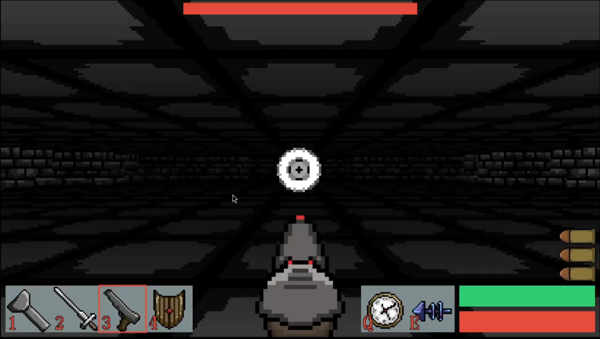

<h1 align="left">Eye Dungeon</h1>
Raycasted dungeon crawler game with 10 levels and a boss.

<http://kainoagardner.xyz/eyedungeon>

<h2 align="left">Gameplay</h2>

<https://youtu.be/PuHCaP0AnjM?si=XzLj8G4t8k25T_OC>
  

<h2>About</h2>

Eye Dungeon

Raycasted dungeon game made completely in typescript. There are 10 levels with one boss at the end with a total of 5 weapons and 2 skills by the end. There are also simple cutscenes between each level showing whats new for each level. Pixel art all done by me.

#### Weapons / Tools
>
> - Flashlight
> - Sword
> - Gun
> - Sheild
> - Horn

#### Abilities
>
> - Run
> - Dash
> - Teleport
